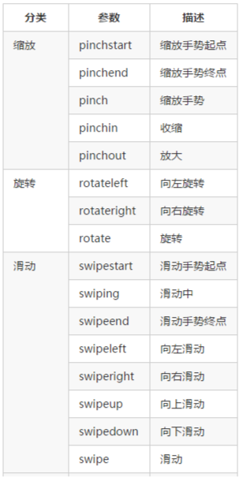
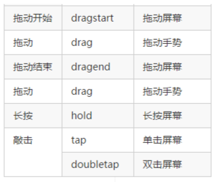
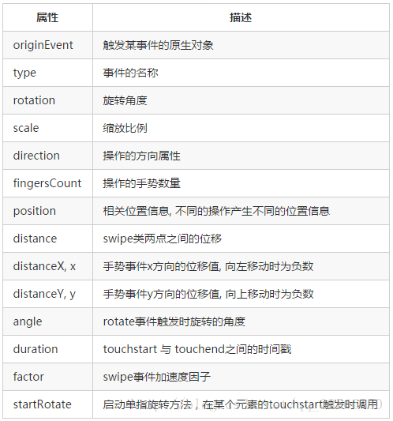

### 手势事件

手势新增的属性

### 事件处理函数 实现移动端拖动元素

<pre>
1. 触摸元素 touchstart：手指触摸到一个 DOM 元素时触发。获取手指初始坐标，同时获得盒子原来的位置。
2. 移动手指 touchmove：手指在一个 DOM 元素上滑动时触发。计算手指的滑动距离，并且移动盒子。
3. 离开手指 touchend：手指从一个 DOM 元素上移开时触发。
4. touchcancel：系统取消触摸事件的时候触发。

拖动元素需要当前手指的坐标值 我们可以使用 targetTouches[0] 里面的pageX 和 pageY。
移动端拖动的原理： 手指移动中，计算出手指移动的距离。然后用盒子原来的位置 + 手指移动的距离。
手指移动的距离： 手指滑动中的位置 减去 手指刚开始触摸的位置。
</pre>

### 触摸事件对象（TouchEvent）

<pre>
TouchEvent是一类描述手指在触摸平面（触摸屏、触摸板等）的状态变化的事件。这类事件用于描述一个或多个触点，使开发者可以检测触点的移动，触点的增加和减少，等等。
监听触摸后触摸事件会实现一个event对象，这个对象里面包括3个触摸函数列表，touchstart、touchmove、touchend三个事件都会各自有事件对象。
1. touches：正在触摸屏幕的所有手指的一个列表。
2. targetTouches：正在触摸当前 DOM 元素上的手指的一个列表。
3. changedTouches：涉及当前事件的手指的一个列表。
</pre>

### 触摸函数的属性
1. clientX      触摸目标在浏览器中的x坐标。
2. clientY      触摸目标在浏览器中的y坐标。
3. identifier      标识触摸的唯一ID。
4. pageX      触摸目标在当前DOM中的x坐标。
5. pageY      触摸目标在当前DOM中的y坐标。
6. screenX      触摸目标在屏幕中的x坐标。
7. screenY      触摸目标在屏幕中的y坐标。
8. target      触摸的DOM节点目标。

### 事件绑定

touch.on(element, types, callback);

### 解除事件绑定

touch.off(element, types, callback);

### 触发事件
touch.trigger(element, type);

### 事件配置

touch.config(config)
<pre>
{
    tap: true,                  //tap类事件开关, 默认为true
    doubleTap: true,            //doubleTap事件开关， 默认为true
    hold: true,                 //hold事件开关, 默认为true
    holdTime: 650,              //hold时间长度
    swipe: true,                //swipe事件开关
    swipeTime: 300,             //触发swipe事件的最大时长
    swipeMinDistance: 18,       //swipe移动最小距离
    swipeFactor: 5,             //加速因子, 值越大变化速率越快
    drag: true,                 //drag事件开关
    pinch: true,                //pinch类事件开关
}
</pre>