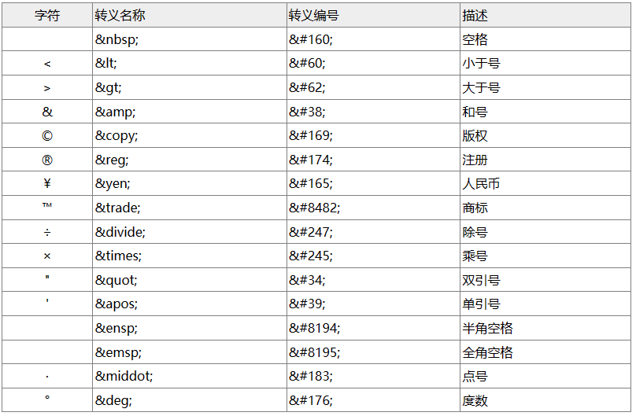
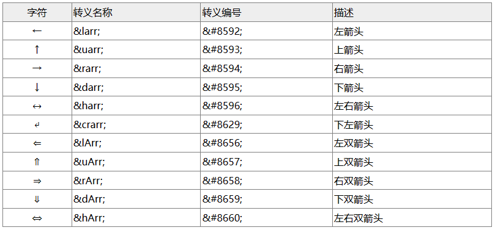
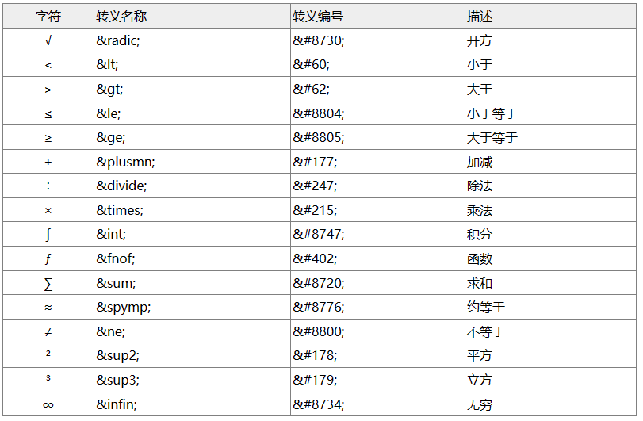
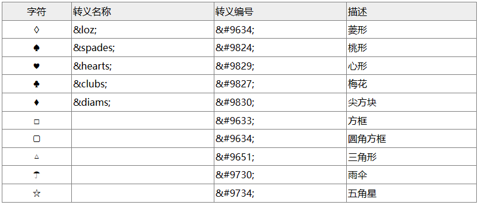
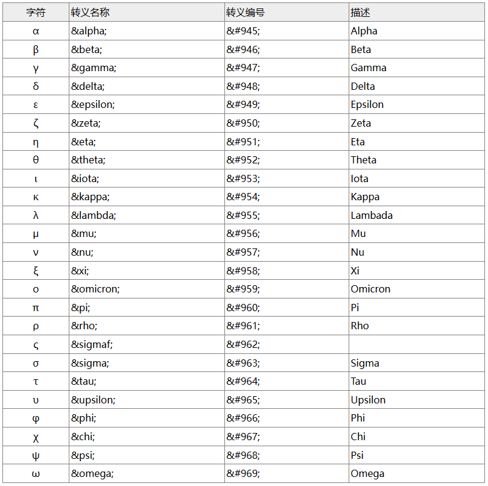
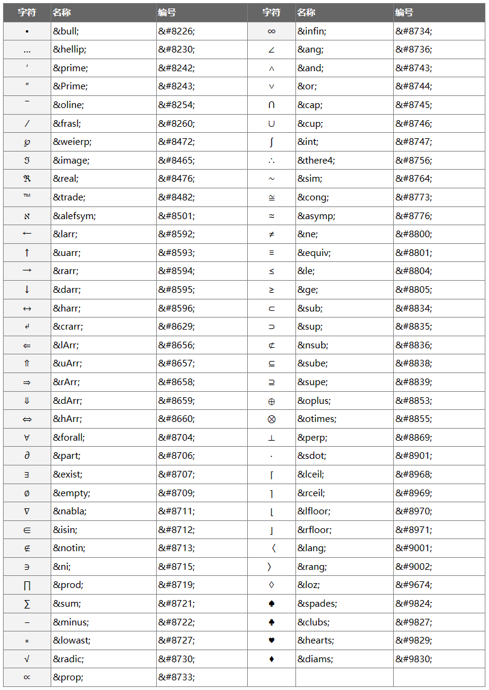

# HTML

是Hyper Text Markup Language的简写，表示超文本标记语言。

## HTML主要标签
标签是由尖括号包围的关键词，通常是成对出现。  
HTML标签 和 HTML元素 通常都是同样的意思。一个HTML元素包含了（第一个标签）开始标签与（第二个标签）结束标签。
<pre>
&lt;!DOCTYPE html&gt; 声明为HTML5文档。
&lt;html&gt; 元素是 HTML 页面的根元素。
&lt;head&gt; 元素包含了文档的元（meta）数据，如 &lt;meta charset="utf-8"&gt; 定义网页编码格式为 utf-8。 保存html文件时，文档编码和meta设置的编码，一定要相同，只要不相同，就一定会出现乱码。
&lt;title&gt; 元素描述了文档的标题。
&lt;body&gt; 元素包含了可见的页面内容。
</pre>

## HTML转义字符表

| 描述 | 实体名称    | 实体编号    |  显示结果   |
|:-------:|:---------:|:---------:|:-------:|
|空格| &nbsp ; | &#160 ; | &#160;  |
|小于号| &lt ;   | &#60 ;  |  &#60;  |
|大于号| &gt ;   | &#62 ;  |  &#62;  |
|和号| &amp ;  | &#38 ;  |  &#38;  |
|单引号| &apos ; | &#39 ;  |  &#39;  |
|双引号| &quot ; | &#34 ;  |  &#34;  |
|版权 | &copy ; | &#169 ; | &#169;  |

#### 常用转义字符表

  

#### 箭头符号

  

#### 数学符号

  

#### 图形符号

  

#### 希腊字母

  

#### 特殊符号

  

## [Browser Object](README%20Browser%20Object.md)

## [DOM Object](README%20DOM%20Object.md)

## [HTML Object](README%20HTML%20Object.md)

## H5

# [CSS](README%20CSS.md)

http://c.biancheng.net/html/